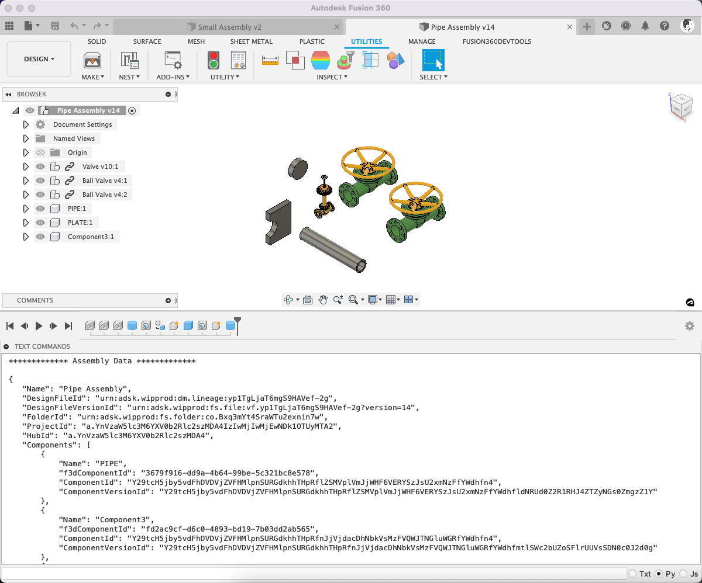

# Fusion Data API IDs from Fusion360 Client API
A collection of utilities to assist in developing Fusion 360 Add-ins



# Usage
Run this script and the Fusion Data IDs will be output to the text command palette.

Use this script as reference for how to generate the IDs 
needed to interact with the 
[Fusion Data API](
    https://forge.autodesk.com/en/docs/fusiondata/v1/developers_guide/overview/
) 
given the current capabilities of the Fusion 360 client API 
(desktop, python API).  
Note this should be obsolete in the coming months 
as the Fusion Data APIs should be supported directly 
in the Fusion 360 Desktop API.

## Utility Functions
To use this in your own project, simply copy the `fusion_data_api_id_utils.py` 
file into your own project directory. Then import one of the following functions and use accordingly.


### get_fusion_data_ids_for_active_document()

Returns the relevant Fusion Data API information for the currently active document.

The results are returned as a typed dictionary as described in **Document** in the results format section below.

### get_fusion_data_ids_for_component(component: adsk.fusion.Component)

Returns the relevant Fusion Data API information for the given component.

The results are returned as a typed dictionary as described in **Component** in the results format section below.

### get_fusion_data_ids_for_design(design: adsk.fusion.Design)

Returns the relevant Fusion Data API information for the given design object.

The results are returned as a typed dictionary as described in **Document** in the results format section below.

## Result Format

### Document
>**Name**: Name of the active design
> 
>**DesignFileId**: The id for the active document's DesignFile in the Fusion Data API
> 
>**DesignFileVersionId**: The id for the active document's DesignFileVersion in the Fusion Data API
> 
>**FolderId**: The id for the active document's parent Folder in the Fusion Data API
> 
>**ProjectId**: The id for the active document's parent Project in the Fusion Data API
> 
>**HubId**: The id for the active document's parent Hub in the Fusion Data API
> 
>**AllComponents**: Array of ALL the components contained in the design, including those in referenced files
> 
>**Components**: Array of only those Components that are defined within this file

#### Note about the `Components` and `AllComponents` fields:
* These are both arrays.
* The values are as defined below in the Component results.

### Component
>**Name**: Name of the active design
> 
>**f3dComponentId**: The id for the Component in the Fusion Client/Desktop API
> 
>**ComponentId**: The id for the Component in the Fusion Data API
> 
>**ComponentVersionId**: The id for the ComponentVersion in the Fusion Data API

## Sample Script
Here is a simple script that demonstrates the usage of `get_fusion_data_ids_for_active_document()`

It will print the contents of the result dict to the text commands palette.  
To enable the text command palette select: **View/Show Text Commands** in the Fusion 360 menu.

```python
import json
import adsk.core
import adsk.fusion
import traceback
from .fusion_data_api_id_utils import get_fusion_data_ids_for_active_document


def run(context):
    app = adsk.core.Application.get()
    ui = app.userInterface
    try:
        results = get_fusion_data_ids_for_active_document()
        output_string = json.dumps(results, indent=4)
        app.log(output_string, adsk.core.LogLevels.InfoLogLevel, adsk.core.LogTypes.ConsoleLogType)
    except:
        if ui:
            ui.messageBox('Failed:\n{}'.format(traceback.format_exc()))
```

## License
Samples are licensed under the terms of the [MIT License](http://opensource.org/licenses/MIT). Please see the [LICENSE](LICENSE) file for full details.

## Written by

Written by [Patrick Rainsberry](https://www.linkedin.com/in/patrickrainsberry/) <br />

